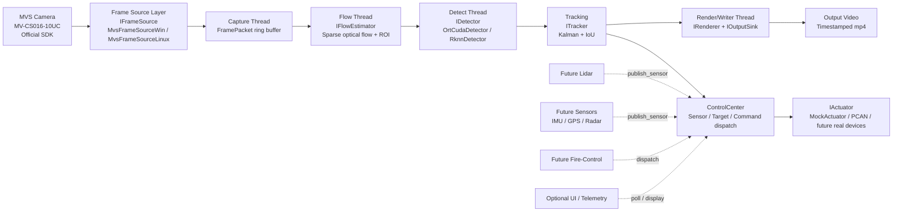

# System Block Diagram

## Layer Notes

### 1. Frame Source Layer

- Handles only device access and frame acquisition.
- Current C++ abstraction:
  - `IFrameSource`
  - `MvsFrameSourceWin`
  - `MvsFrameSourceLinux`
  - `VideoCaptureSource`

### 2. Vision Pipeline

- The runtime is intentionally split into asynchronous stages:
  - capture
  - flow
  - detect
  - render/write
- This keeps output continuous even when detection is slower than the target frame rate.

### 3. Detection and Tracking

- `IFlowEstimator` computes sparse optical flow on fixed points and derives a vertical ROI strip.
- `IDetector` runs person detection on the full frame with ROI-aware attention / filtering.
- `ITracker` keeps box continuity across frames.

### 4. Output and Headless Modes

- `IRenderer` overlays motion points, ROI, detections, tracks, and timing stats.
- `IOutputSink` decouples rendering from persistence:
  - `VideoFileSink`
  - `NullSink`
- Supported runtime combinations:
  - show + record
  - show + no-record
  - headless + record
  - headless + no-record

### 5. Control Center

- `ControlCenter` is the stable integration hub for:
  - sensor snapshots
  - target observations
  - actuator commands
- New subsystems should connect here instead of coupling directly into camera or detector code.

### 6. ROCK 5B Portability

- The business pipeline stays the same across platforms.
- Only backend implementations should change:
  - Windows: `OrtCudaDetector`, Windows MVS SDK, Windows PCAN path
  - ROCK 5B: `RknnDetector`, Linux MVS SDK, Linux PCAN path
